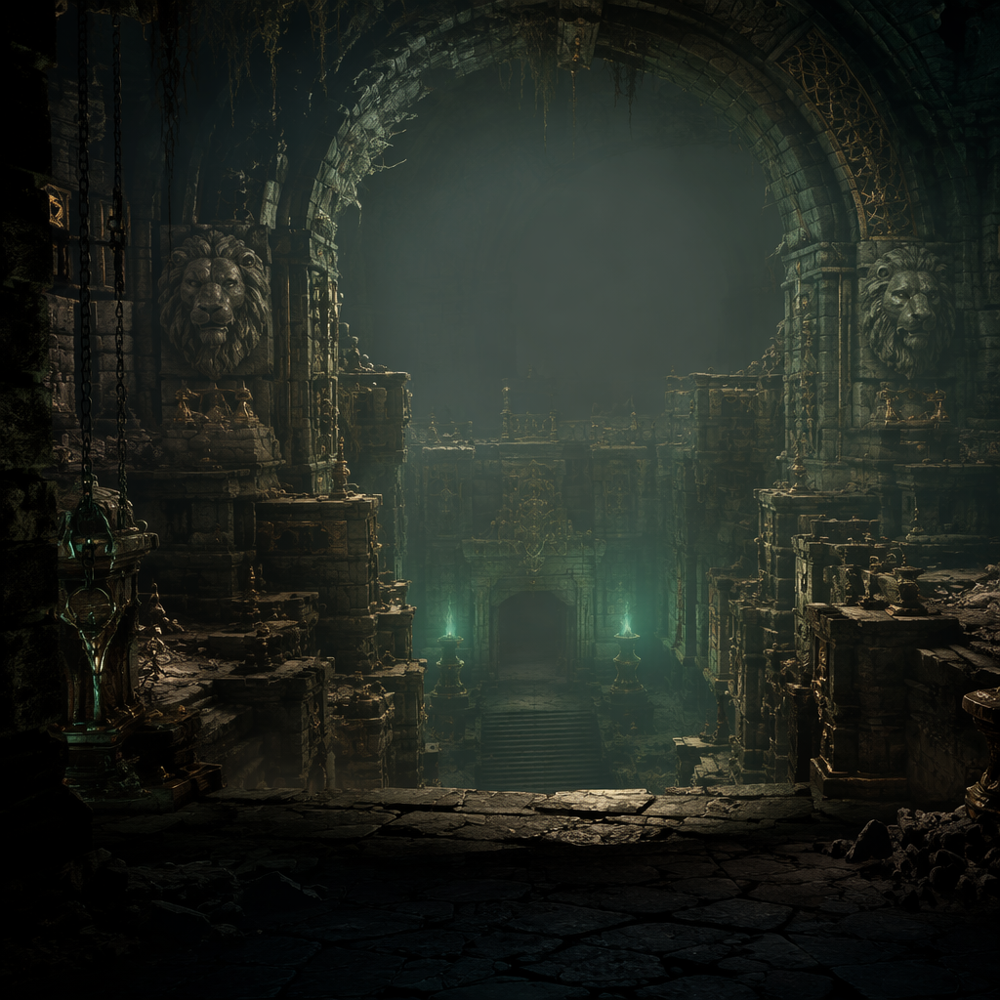
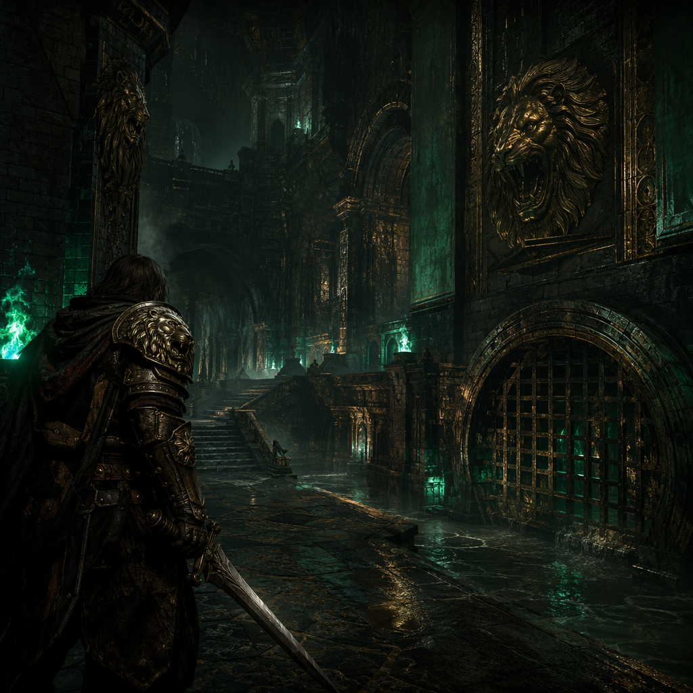
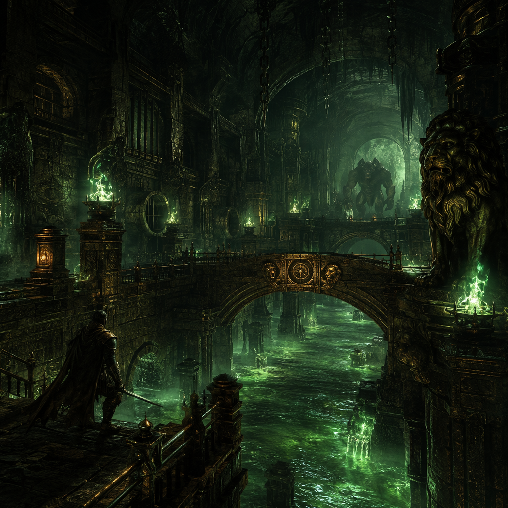

# Leo的地牢围攻

> 守住最后的火，走完自己的远征。



《Leo的地牢围攻》是一款面向 macOS、iPhone 与 iPad 的中文离线 Roguelike 地牢游戏。它基于 GPLv3 开源项目 Shattered Pixel Dungeon 二次开发，并围绕 Leo 的个人审美、中文体验、黑金翡翠狮王视觉和更明确的打击反馈重新设计。

[](https://github.com/leoyb1010/Leogame-one/actions/workflows/ci.yml)


## 这不是简单换皮

- **Leo 专属身份**：游戏名、Apple Bundle ID、远征档案、远征日志、首次授予狮印和版本记录形成统一产品叙事。
- **中文优先**：首次启动默认简体中文，全局界面中文；设置中可切换 English。
- **原创主视觉**：黑铁、旧金、翡翠灵火、狮首徽记贯穿标题、按钮、面板、图标和章节插画。
- **更清晰的战斗反馈**：斩击、突刺、钝击拥有差异化震屏、粒子、材质音和触觉反馈，强度可调。
- **更利落的操作**：移动视觉动画缩短 25%，不改变回合耗时、敌人速度或平衡数值。
- **纯离线**：无广告、无强制账号，存档默认只保存在设备本地。

## 当前版本

| 项目 | 状态 |
|---|---|
| 游戏版本 | `1.0.0` |
| Apple Bundle ID | `leogameone` |
| 默认语言 | 简体中文 |
| 可切换语言 | English |
| macOS | 已构建、已实机验证 |
| iPhone / iPad | 当前重点支持 |
| Android | 保留源码，本阶段暂不维护 |

## 视觉预览

| 战士远征 | 下水道区域 |
|---|---|
|  |  |

原始生成素材位于 `artwork/inbox/`，处理后的透明素材位于 `artwork/processed/alpha/`，游戏运行时资源由 `scripts/process_leo_artwork.py` 生成。这样可以保留原图，并避免反复压缩。

## 快速开始

### 环境要求

- Apple Silicon 或 Intel Mac
- Xcode（包含所需 iOS Simulator Runtime）
- Homebrew OpenJDK 17

### 构建 macOS

```bash
scripts/apple-gradle :desktop:jpackageImage
```

### 启动 iPhone / iPad 模拟器

```bash
scripts/apple-gradle :ios:launchIPhoneSimulator
scripts/apple-gradle :ios:launchIPadSimulator
```

构建产物统一放在 macOS 用户缓存目录的 `leogameone-gradle/` 下，避免 iCloud/FileProvider 目录造成 Gradle 文件锁与签名异常。完整说明见 [APPLE_DEVELOPMENT.md](APPLE_DEVELOPMENT.md)。

## 项目结构

```text
core/       游戏规则、场景、中文资源、运行时美术
desktop/    macOS/桌面启动器与图标
ios/        iPhone/iPad 启动器、Info.plist、AppIcon
services/   离线调试用更新与新闻服务适配
artwork/    Leo 原始素材与透明处理结果
scripts/    Apple 构建包装器和素材处理管线
docs/       美术规范、升级路线与开发说明
```

核心规则层继续沿用稳定的 Java 包名，避免大规模包迁移破坏存档兼容；用户可见产品名和 Apple Bundle ID 已全部独立为 Leo 版本。

## 战斗命中说明

本项目没有提高或降低原始命中率。一级战士对普通下水道老鼠约有 90% 命中率；白蛇是教学型高闪避敌人，正面攻击命中率约 20%，应将它引过门后伏击。Leo 版会在第一次被白蛇闪避时直接显示中文提示，避免误判为输入或命中故障。

## 文档

- [Apple 开发与构建](APPLE_DEVELOPMENT.md)
- [高清素材生成与投放规范](docs/ARTWORK_GENERATION_BRIEF_ZH.md)
- [个人专属版完整升级路线](docs/NEXT_UPGRADE_RECOMMENDATIONS_ZH.md)
- [版本记录](CHANGELOG.md)
- [架构与产品边界](docs/ARCHITECTURE_ZH.md)
- [贡献指南](CONTRIBUTING.md)
- [安全说明](SECURITY.md)

## 开源与知识产权边界

代码基于 [Shattered Pixel Dungeon](https://github.com/00-Evan/shattered-pixel-dungeon) 与 [Pixel Dungeon](https://github.com/00-Evan/pixel-dungeon-gradle)，继续遵循 [GPLv3](LICENSE.txt)。原作者、翻译者、音乐、美术和音效署名保留在游戏“关于”页面和源码版权头中。

`artwork/` 中 Leo 新增的定制素材随本仓库源码发布；第三方原始素材仍遵循各自署名与许可。分发修改版时，必须同步提供对应源码、GPLv3 许可证及必要署名。

## 致谢

- Evan Debenham — Shattered Pixel Dungeon
- Watabou — Pixel Dungeon
- Aleksandar Komitov、Lumine Haaristo、Celesti 及原项目所有贡献者
- Shattered Pixel Dungeon 翻译社区

---

为 Leo 制作。每次失败都写进档案，每次深入都算一次自己的远征。
