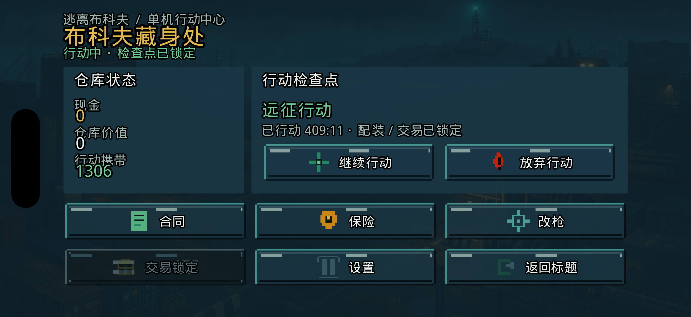
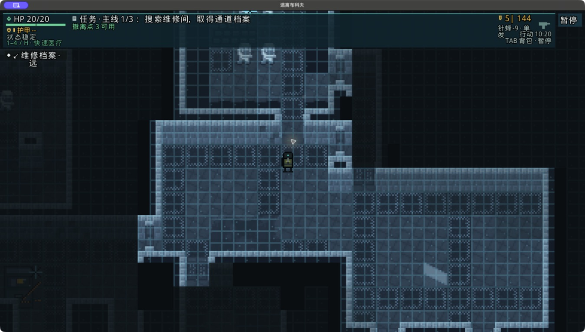
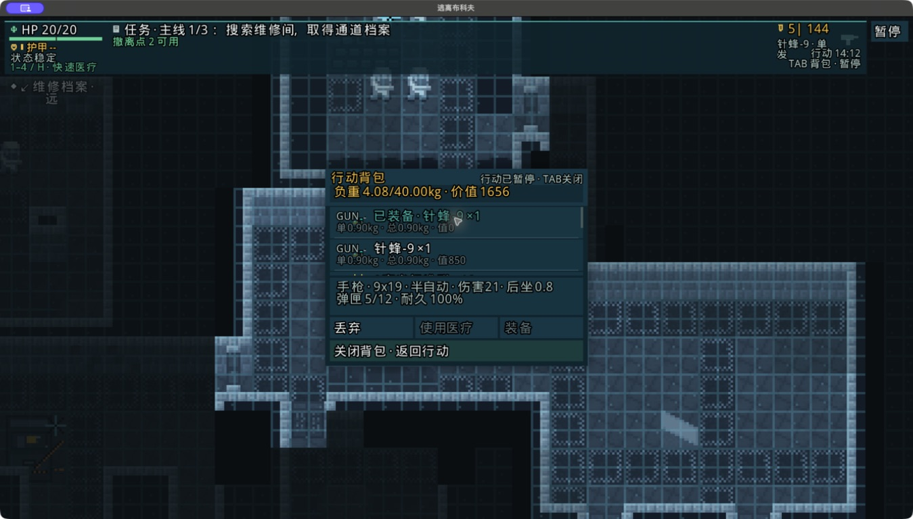
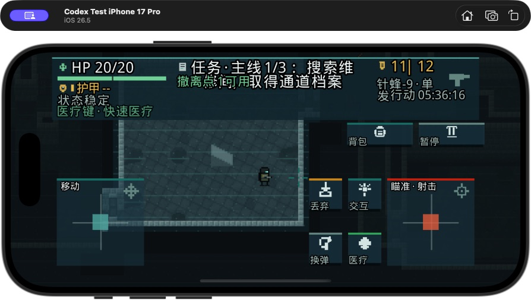

# 逃离布科夫 · ESCAPE FROM BUKOV

<div align="center">

**离线单机 · 俯视角 · 实时战斗 · 像素搜打撤**

> 搜到什么不算本事，能带回来才算。

[](https://github.com/leoyb1010/Leogame-one/actions/workflows/ci.yml)


</div>

<p align="center">
  
</p>

《逃离布科夫》是一款面向 macOS、iPhone 和 iPad 的离线单机搜打撤游戏。
玩家从行动中心整理仓库与配装，进入程序化地图搜索物资、完成任务、处理敌人，
并在风险继续升高之前决定深入还是撤离。成功带出的装备会进入长期仓库；
行动中死亡，则失去本局携带物。

项目以 **Leogame-one** 为主工程，沿用 Shattered Pixel Dungeon 稳定的地图、
渲染和跨平台基础，并把玩家主流程重构为实时移动、枪械战斗、搜刮、撤离、
结算与长期养成。它不是原作的职业/回合制入口换皮，而是一条独立的布科夫玩家路径。

> 当前版本是可运行、可打包的个人开发 Alpha，不是商业发行版，也不代表最终美术封板。

---

## 游戏截图

### macOS 实时行动

<p align="center">
  
</p>

探索过的区域逐步点亮；地图跟随角色移动。顶部 HUD 同时显示任务、生命、
护甲、弹药、医疗状态、行动时间和可用撤离点。

### 行动背包与局内决策

<p align="center">
  
</p>

局内背包显示重量、价值、枪械、弹药和物品状态。打开背包会暂停单机行动，
关闭窗口时不会补发射击、重复打开或把旧输入带回战斗。

### iOS 横屏触控

<p align="center">
  
</p>

iOS 使用双区触控：左侧移动、右侧瞄准射击，并提供背包、交互、换弹、
医疗、丢弃和暂停图标。HUD 会为刘海、安全区和三档 UI 缩放预留空间。

---

## 一局游戏怎么玩

```text
行动中心
  ↓ 整理仓库 / 购买补给 / 选择模式
配装确认
  ↓ 枪械 + 弹药 + 护甲 + 医疗
进入行动
  ↓ 探索地图 → 搜索容器 → 获取任务物 → 与敌人交战
风险决策
  ├─ 继续深入：更高收益，也可能失去全部携带物
  └─ 及时撤离：保住本局战利品
结算
  ↓ 战利品入仓 / 任务推进 / 经济变化
下一次行动
```

核心不是“把地图清空”，而是判断什么时候已经赚够、哪条路线值得冒险，
以及手里的弹药和医疗还能不能支持下一场交火。

---

## 五种游戏模式

| 模式 | 节奏 | 主要目标 |
|---|---|---|
| **远征行动** | 标准完整局 | 搜刮、主线任务、动态交战并成功撤离 |
| **快速清扫** | 时间更短 | 在有限时间内获取物资并迅速离场 |
| **拾荒者** | 资源压力高 | 以低配装开局，依靠现场搜刮活下来 |
| **Boss 合同** | 高危险战斗 | 追踪并击败 Boss，携带合同战利品撤离 |
| **演练场** | 低损失练习 | 熟悉移动、瞄准、射击、换弹、医疗与交互 |

五种模式共用同一套实时模拟、装备、敌人、搜刮和结算逻辑，不另建简化战斗系统。

---

## 当前内容规模

| 内容 | Alpha 34 |
|---|---:|
| 程序化地图主题 | 6 |
| 枪械 | 18 |
| 弹药类型 | 8 |
| 普通敌人 | 9 |
| 精英敌人 | 3 |
| Boss | 1 |
| Raid 模式 | 5 |
| 物品/交互逻辑图标帧 | 72 |
| 项目原创 PCM 音效 | 83 |

地图主题包含不同房间结构、路线地标、封锁门、搜索容器、任务节点与撤离条件。
敌人具备视野/声音感知、追击或距离控制、开火、换弹、受击、死亡和掉落流程。

---

## 已实现的核心系统

### 实时枪战

- 固定 120 Hz 模拟步长，渲染帧率不会改变战斗结果。
- 鼠标、触控和控制器瞄准接入同一套射击逻辑。
- 半自动/自动开火、弹匣、备弹、换弹、空仓和枪械耐久。
- 命中扫描、曳光、枪口火焰、命中反馈、伤害弧和声音方向提示。
- 玩家与敌人伤害来源隔离；射墙不会反伤玩家。

### 搜刮与撤离

- 搜索容器、地面物品、敌人掉落和唯一物品 UID。
- 背包容量、重量、价值、稀有度与局内装备管理。
- 任务物品解锁通道，门和碰撞状态在实时世界中同步更新。
- 多种撤离条件、交互进度、中断处理和成功/死亡结算。
- 同一 Raid 结算幂等，避免重复领取或重复丢失物品。

### 长期仓库与经济

- 行动前配装检查，避免缺枪、缺弹或无效配装进入行动。
- 长期仓库、现金、补给商店、购买/出售和行动期间交易锁定。
- 成功带出入仓，死亡按规则损失携带物。
- Raid 检查点、原子存档、恢复和存档版本兼容门禁。

### 高品质交互

- macOS 窗口模式、鼠标跟随瞄准和明确准星。
- iOS 横竖屏、安全区、刘海、三档缩放和图标化触控按钮。
- 响应式 HUD：任务、导航、威胁、武器、医疗、Boss 与撤离文案自动收口。
- 色盲、降低动效、闪光、震屏/震动、瞄准辅助和摇杆曲线设置。
- 布科夫专用键位目录，不把原作职业动作和旧玩家入口带入当前流程。

---

## 操作

### macOS

| 操作 | 默认输入 |
|---|---|
| 移动 | `W A S D` |
| 瞄准 | 鼠标移动 |
| 射击 | 鼠标左键 |
| 交互/搜索 | `E` |
| 换弹 | `R` |
| 背包 | `Tab` |
| 快速医疗 | HUD 提示键 |
| 暂停 | `Esc` 或暂停按钮 |

### iOS

- 左侧移动区控制角色移动。
- 右侧瞄准区控制方向并射击。
- 中央动作区提供交互、换弹、医疗、背包、丢弃与暂停。
- 控件会根据横屏、竖屏、安全区和 UI 缩放重新排布。

键位可在设置中调整；控制器动作与菜单焦点由同一输入目录管理。

---

## Alpha 34 阶段状态

当前封存提交：

```text
以本文件所在的干净提交及封存清单为准
```

本阶段重点关闭了：

- 把首局真实玩家路线门禁从 10 条提升到默认 200 条，避免小样本掩盖断路。
- 修复搜索容器、地面战利品与相邻水泵竞争交互焦点，任务物不再出现“有提示但捡不到”。
- 首局引导敌人只生成在存在真实直线交火通道的位置，避免敌人隔墙或卡在墙角后不可交战。
- 演练场免费配装补齐软质护甲、止血带和急救包，医疗教学不再出现“有按键、没药品”。
- 演练场保留真实受击与医疗反馈，但单次敌方命中最多 1 点伤害，避免新玩家在教学动作完成前被秒杀。
- 补齐碰撞与视线查询审计，新增查询必须显式经过测试白名单评审。
- 保留 Alpha 33 已关闭的输入转场、响应式 HUD、背包可读性与 iOS AOT 修复。

完整变更见 [Alpha 34 阶段封存说明](docs/bukov/ALPHA34_CHANGELOG_ZH.md)。

### 自动验收

| 模块 | 结果 |
|---|---:|
| Core | 以本次封存报告为准，0 failure |
| Desktop | 10 tests，0 failure |
| iOS | 11 tests，0 failure |
| 首局真实路线 | **10,000 结构 Seed + 200/200 production World 路线** |

同时通过音频、敌人图集、物品图集、本地化、原创视觉、六主题结构、UI 图集、
UI/Motion Token、法律文件、地图可见性、战利品可发现性、内容规模和 RoboVM API
兼容门禁。macOS 与 iOS Simulator 已从同一提交重新打包、签名、安装并启动。

### 尚未冒充完成的工作

- 物理 iPhone 完整路线。
- 实体控制器从启动到撤离的全流程。
- 当前提交双端各 30 分钟连续渲染长测及物理 GPU/热状态证据。
- 五模式真人通关、10 名玩家复玩测试和三人音频盲测。
- 24 张最终原创环境母图与最终美术签字。

因此当前定位是 **高完成度个人 Alpha**，不是 v2.0 的最终商业封板。

---

## 本地构建

### 环境

- macOS
- Homebrew OpenJDK 17
- Xcode 与所需 iOS Simulator Runtime
- Git、Python 3、Node.js、FFmpeg、jq、ripgrep

### 完整测试

```bash
./scripts/apple-gradle \
  core:test desktop:test ios:test \
  --rerun-tasks --no-daemon
```

### macOS 应用

```bash
./scripts/apple-gradle \
  :desktop:jpackageImage \
  --rerun-tasks --no-daemon
```

### iPhone Simulator

```bash
./scripts/apple-gradle \
  :ios:launchIPhoneSimulator \
  -Probovm.device.name="你的模拟器名称" \
  --rerun-tasks --no-daemon
```

### 生成同源码身份的双端个人包

```bash
release_sha="$(git rev-parse HEAD)"
release_short="$(git rev-parse --short=12 HEAD)"
output_root="/absolute/path/to/output"

./scripts/bukov_package_personal_build.sh \
  --output "$output_root" \
  --version "personal-${release_short}" \
  --apply

./scripts/bukov_install_personal_build.sh \
  --package "$output_root/逃离布科夫-personal-${release_short}" \
  --expected-source-commit "$release_sha" \
  --device-udid "已启动的 iPhone Simulator UDID" \
  --apply
```

打包器会拒绝脏工作树、旧源码缓存和双端 SHA 不一致。安装器会校验 ZIP、
签名、可执行文件哈希和目标 Simulator，并保存安装回执。

---

## 质量门禁

常用专项检查：

```bash
./scripts/bukov_audio_gate.sh
./scripts/bukov_enemy_sprite_gate.sh
./scripts/bukov_item_atlas_gate.sh
./scripts/bukov_localization_gate.sh
./scripts/bukov_original_visual_gate.sh
./scripts/bukov_theme_visual_gate.sh
./scripts/bukov_ui_asset_gate.sh
zsh ./scripts/bukov_ui_tokens_check.sh
python3 ./scripts/bukov_content_scale_gate.py
python3 ./scripts/bukov_robovm_api_gate.py
./scripts/bukov_seed_sweep.sh 10000
./scripts/bukov_save_stress.sh 100
```

最终串行封板门禁见：

```bash
zsh ./scripts/bukov_final_gate.sh --help
```

它会绑定源码提交、主机环境、全量测试、10,000 Seed、100 次真实磁盘存档、
性能证据、双端构建和最终包来源完整性。

---

## 工程结构

```text
core/src/main/java/.../bukov/   实时战斗、地图、AI、Raid、存档、经济与 UI
core/src/main/assets/bukov/     枪械、弹药、敌人、主题、UI Token 与内容数据
core/src/test/java/.../bukov/   单元、回归、路径、种子、存档与性能门禁
desktop/                        macOS/桌面启动器、窗口逻辑和应用图标
ios/                            iPhone/iPad 启动器、触控、安全区与 AppIcon
artwork/                        原始素材、生成工具、来源与许可证记录
docs/bukov/                     开发计划、实现矩阵、审计和验收证据
scripts/                        Apple 构建、打包、安装和专项质量门禁
```

主要代码坚持以下边界：

- 实时模拟与视觉表现分离。
- VFX、声音、震屏和 HUD 只能消费事件，不能反向改变命中结果。
- 枪械、弹药、仓库与局内携带物使用同一实例/UID 体系。
- 撤离、死亡和恢复流程必须可重入、可追踪且不可重复结算。
- 所有“已经完成”的结论必须对应自动测试、包或真实运行证据。

---

## 项目文档

- [Alpha 34 阶段封存说明](docs/bukov/ALPHA34_CHANGELOG_ZH.md)
- [Alpha 33 阶段封存说明](docs/bukov/ALPHA33_CHANGELOG_ZH.md)
- [v2.0 逐条完成度审计](docs/bukov/V2_COMPLETION_AUDIT.md)
- [布科夫实现矩阵](docs/bukov/IMPLEMENTATION_MATRIX.md)
- [当前里程碑验收](docs/bukov/MILESTONE_ACCEPTANCE_2026-07-23.md)
- [最终 QA 报告模板](docs/bukov/FINAL_QA_REPORT_TEMPLATE.md)
- [性能门禁说明](docs/bukov/PERFORMANCE_GATES.md)
- [美术素材清单](docs/bukov/ART_ASSET_MANIFEST.md)
- [发行来源与许可证审计](docs/bukov/RELEASE_PROVENANCE_AUDIT.md)
- [第三方借鉴边界](docs/THIRD_PARTY_BORROWING.md)
- [源码与素材来源台账](docs/SOURCE_PROVENANCE.csv)
- [Apple 开发与构建](APPLE_DEVELOPMENT.md)

---

## 开源、来源与免责声明

本项目基于
[Shattered Pixel Dungeon](https://github.com/00-Evan/shattered-pixel-dungeon)
与 [Pixel Dungeon](https://github.com/00-Evan/pixel-dungeon-gradle) 的 GPLv3
代码继续开发，遵循 [GNU GPLv3](LICENSE.txt)。原项目作者、翻译、音乐、
美术和音效署名必须保留。

新增源码与素材的来源、借鉴方式和许可证记录在
[`docs/SOURCE_PROVENANCE.csv`](docs/SOURCE_PROVENANCE.csv)、
[`docs/THIRD_PARTY_BORROWING.md`](docs/THIRD_PARTY_BORROWING.md) 和
[`artwork/licenses/`](artwork/licenses/)。

《逃离布科夫 / Escape from Bukov》是个人、非商业、离线单机实验项目。
它与《逃离塔科夫》、Battlestate Games 及其他商业游戏不存在授权、隶属或官方关系。
对外分发修改版时，必须同步提供对应源码、GPLv3 许可证和必要的第三方声明。

<div align="center">

**开发仍在继续。每一条“完成”，都应该能在代码、测试和实际运行中被重新证明。**

</div>
