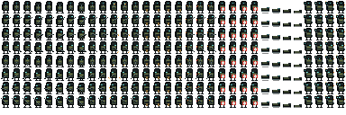
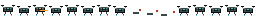
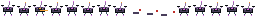

# 逃离布科夫：角色与敌人动画预览

这些图均由仓库内脚本从几何图元确定性生成，可以重新生成并逐字节验收。

## 玩家干员

- 每行一个方向：`N / NE / E / SE / S / SW / W / NW`
- 帧段：待机 `0–1`、移动 `2–7`、举枪 `8–9`、射击 `10–12`、
  换弹 `13–16`、受击 `17–19`、治疗 `20–23`、倒地 `24–27`、
  撤离 `28–31`
- 所有站立动作使用相同脚底锚点；每个方向在
  `bukov_operator_manifest.json` 中拥有独立枪口锚点。

## 普通、精英与 Boss

| 原型 | 预览 | 识别重点 |
|---|---|---|
| 近战拾荒者 |  | 棕色轻装、帽檐 |
| 武装拾荒者 |  | 橄榄色步枪手 |
| 铁钳卫兵 |  | 宽重钢甲、琥珀面罩 |
| 铁钳队长 |  | 黑红指挥甲 |
| 传感人偶 |  | 低矮双旋翼轮廓 |
| 巷道侦察兵 |  | 青色兜帽 |
| 仓库霰弹手 |  | 橙色宽肩 |
| 阵线步枪手 |  | 蓝色制式装具 |
| 雾中潜猎者 |  | 暗绿兜帽、低可视轮廓 |
| 信号操作员 |  | 紫色机体、长天线 |
| 铁钳神射手 |  | 浅色长瞄具、天线 |
| 破门老兵 |  | 红色重肩甲 |
| 白线 |  | 白色雨衣；帧 11–15 分别呈现伞盾、诱饵、雾灯过载与弱点 |

普通与精英图集统一保留待机、攻击、移动、死亡四个核心动作。视觉身份帧
位于 `11–15`；白线的同一帧段由运行时直接映射三阶段状态和可伤害窗口。
